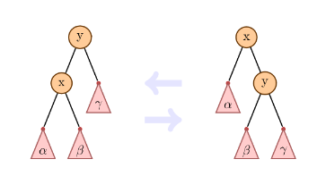
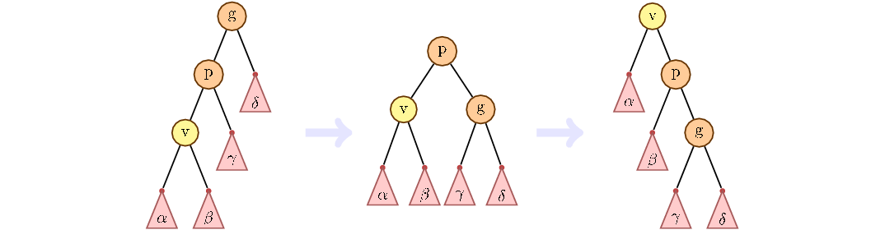
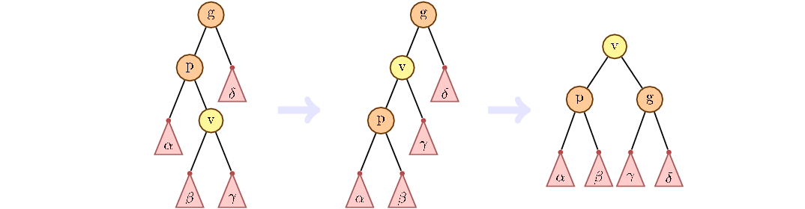

# algos_2
//Житарюк Юлія

Splay-дерево - це дерево бінарного пошуку, що самоблансується. Воно не потребує ніякої додаткової інформації, що робить його ефективним за пам'яттю. Після кожного звернення, навіть пошуку, дерево змінює свою структуру. Після звернення до вершини, ця вершина підіймається в корінь. Отже елементи, які були нещодавно викликані, залишаються близько до кореня.

Перейдемо до реалізації.
Для кожної вершини зберігаємо ключ, вказівники на батька та лівого і правого сина. 

set_parent встановлює вказаного батька вказаній вершині, якщо остання існує.

keep_parent синам переданої вершини встановлює батьком дану вершину.

rotating змінює місцями сина з батьком.

Але просто повертати вершину, доки вона не стане коренем, недостатньо. Хитрість у тому, що при просуненні вершини до кореня усі її нащадки також просуваються ближче до кореня. Для цього використовується техніка zig-zig і zig-zag поворотів.
Основна ідея в тому, що ми розглядаємо шлях від дідуся до дитини. Якщо він іде лиге по лівим дітям чи лише по правим, то така ситуація називається zig-zig. Нижче спосіб її обробки.

Інакше спочатку змінбємо вершину з поточним батьком, а потім з новим.

Якщо у вершини немає дідуся, робимо звичайний поворот.

splay. Беремо вершину і "тягнемо" її вгору, до кореня. в цей час усі інші вершини йдуть донизу, повертаючись навколо неї.

finding. Звичайний попук бінарного дерева, що в кінці процедури викликає splay, щоб витягнути в корінь вершину, до якої звернулись.

spliting отримує на вхід ключ key і ділить дерево на 2. В одному всі значення менші за key, в іншому - більші. Через find знаходимо найближчу до ключа вершину, тягнемо її в корінь і "відрізаємо" ліме або праве піддерево (або обидва).

inserting викликає spliting за заданим ключем, після робить нову вершину-корінь, у якої піддеревами будуть дерева, отримані у результті роботи spliting.

merging отримує на вхід два дерева - ліве left і праве right. Для коректної роботи ключі дерева left мають бути меншими за ключі дерева right. Беремо вершину з найменшим ключем правого дерева right  і тягнемо вгору. Після цього в якості лівого піддерева приєднуємо дерево left.

removing піднімає вершину вгору, а потім зливає її ліве і праве піддерево.
